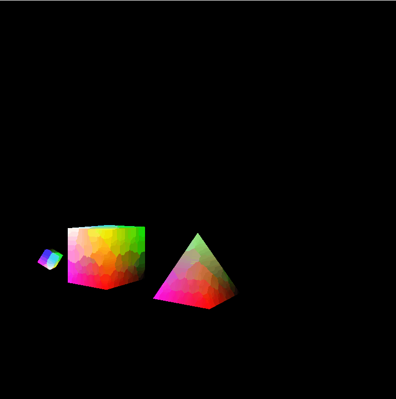

# Solar-System-Model
A basic model of a prism rotating in the center with 2 cubes orbiting around each other while rotating around the prism. All code is written in C++ using OpenGL and GLSL. My plan is to now create spheres to model the solar system.

