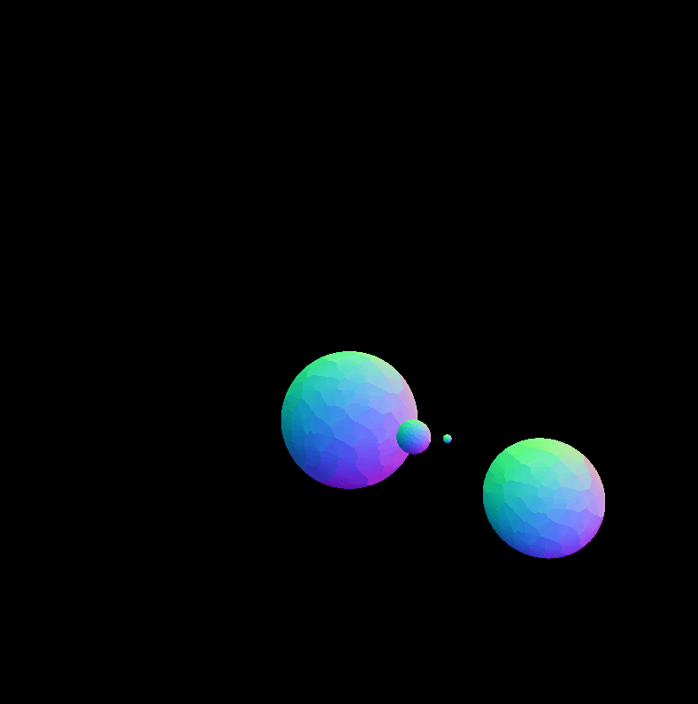

# Solar-System-Model
A basic model of a few planets orbiting around each other.. All code is written in C++ using OpenGL and GLSL. My plan is to now add additional spheres and textures to accurately model the solar system.

